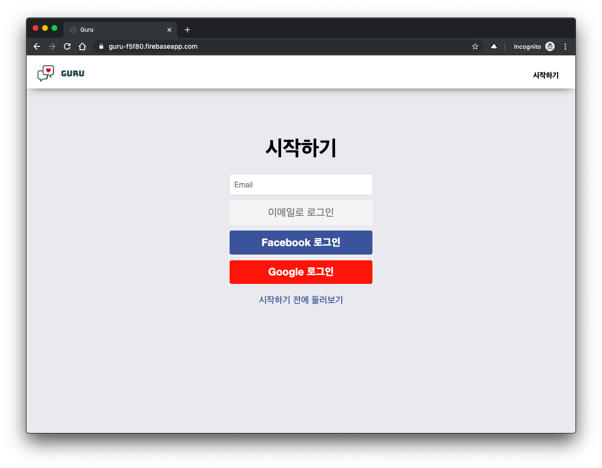
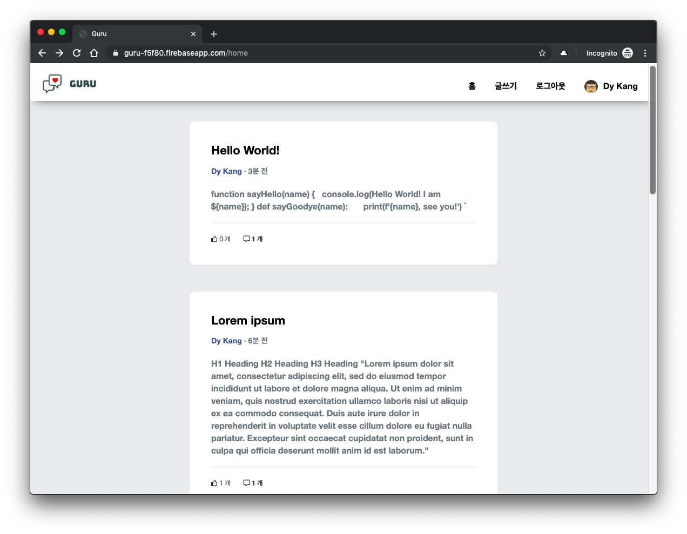
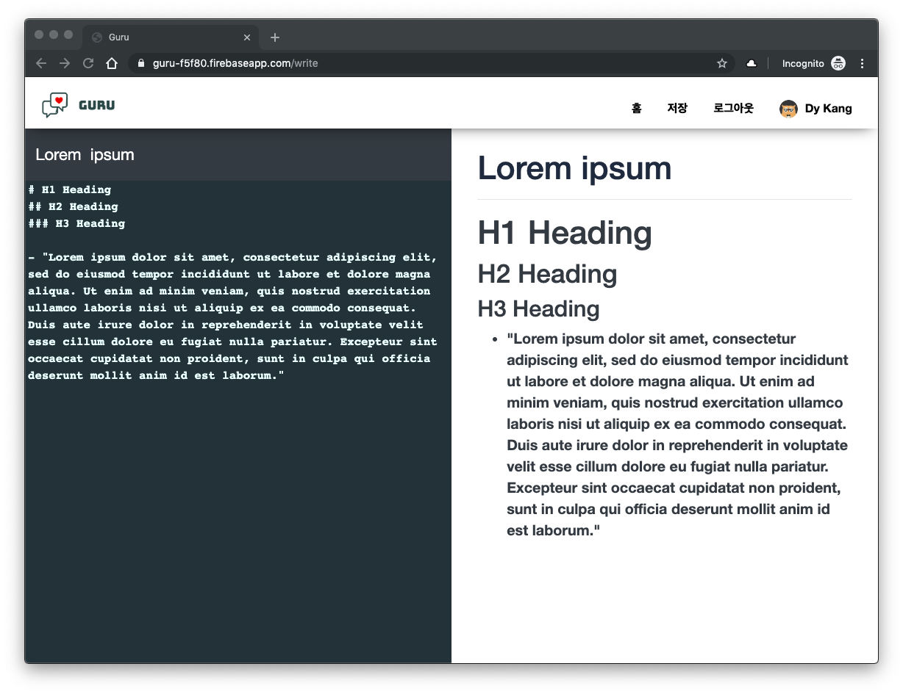
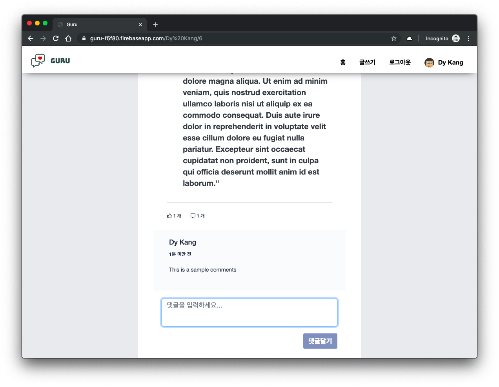

# React-Redux-Firebase Blog

Live Demo: [guru-f5f80.firebaseapp.com](https://guru-f5f80.firebaseapp.com)

## Getting Started

To get this app running locally:

- git clone
- npm install
- npm run build
- npm run dev
  
Local web server will use port 1234. You can change this in `devServer` section of `webpack.config.js`.

## Libraries and Frameworks

This application is made of:

- React
- React-Router
- Redux
- Redux-Thunk
- Firebase(Auth, Database and Deploy)
- styled-jsx
- Webpack
- Marked, CodeMirror, Prismjs
- date-fns
  
## Functionality Overview

The example application is a social blogging site called `Guru`. This application used only functional components and used `Hook` and `Higher Order Components`.

General Functionality:

- __Passwordless Authentication__ - Email link, OAuth(Facebook and Google) 
  

- Display list of posts, likes of the post and number of comments(A user can only press __Like once__ for the same post)
  

- Writing a post with __markdown editor__
  

- Display __created time in words__ in the posts and comments(Used date-fns library)
  

 

